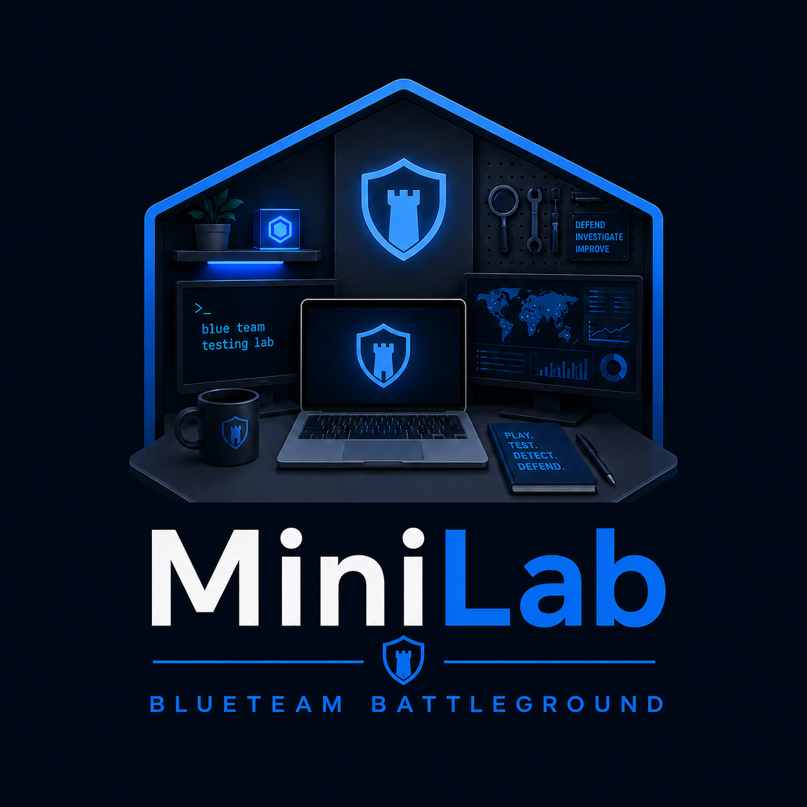

# MiniLab SOC — Vagrant Blue Team Lab

> I don't always have access to Ludus, especially when travelling. Hence this idea, inspired by the original concept of [DetectionLab](https://github.com/clong/detectionlab).

A three-VM defensive security lab running on VirtualBox, built for practising detection engineering. SIEM is ELK 8.x by default; Splunk Enterprise and Wazuh are available as drop-in alternatives (`ENABLE_SPLUNK=true` / `ENABLE_WAZUH=true`).

**Full documentation: [enonethreezed.github.io/MiniLab](https://enonethreezed.github.io/MiniLab/)** — installation, usage, and all optional features (Splunk, Guacamole).

## Virtual machines

| VM | Box | IP | RAM | Role |
|---|---|---|---|---|
| `siem` | debian/bookworm64 | 192.168.56.10 | 12 GB | SIEM — ELK 8.x + Fleet Server by default, or Splunk Enterprise / Wazuh |
| `winserver` | gusztavvargadr/windows-server-2022-standard | 192.168.56.20 | 4 GB | Windows Server endpoint + `minilab.local` Domain Controller |
| `win11` | gusztavvargadr/windows-11 | 192.168.56.30 | 4 GB | Windows 11 workstation, joined to `minilab.local` |
| `kali` | kalilinux/rolling | 192.168.56.100 | 4 GB | Attacker box, `ENABLE_KALI=true` |

## Quick start

```bash
./install.sh    # or vagrant up directly; .\install.ps1 on Windows
bash tests/check-lab.sh
```

See [Installation](https://enonethreezed.github.io/MiniLab/install.html) for
requirements and [Usage](https://enonethreezed.github.io/MiniLab/usage.html)
for the full command reference.

## Issue tracking

Tracked with [bd (beads)](https://github.com/gastownhall/beads); every task
has a linked GitHub issue.
