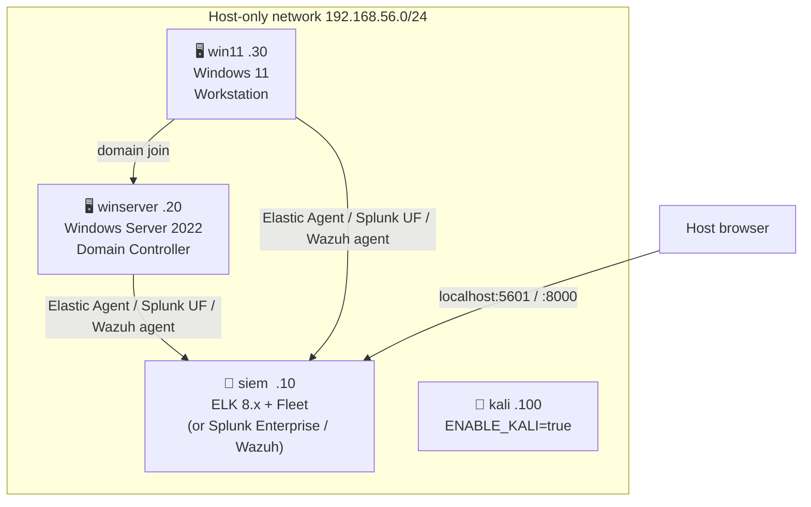

# MiniLab SOC

> I don't always have access to Ludus, especially when travelling. Hence this
> idea, inspired by the original concept of
> [DetectionLab](https://github.com/clong/detectionlab).

A three-VM defensive security lab running on VirtualBox, built for
practising detection engineering. SIEM is ELK 8.x by default; Splunk
Enterprise and Wazuh are available as drop-in alternatives.

## Virtual machines

| VM | Box | IP | RAM | Role |
|---|---|---|---|---|
| `siem` | bento/debian-13 | 192.168.56.10 | 12 GB | SIEM — ELK 8.x + Fleet Server by default, or Splunk Enterprise (`ENABLE_SPLUNK=true`) / Wazuh (`ENABLE_WAZUH=true`) (+ optional Guacamole) |
| `winserver` | gusztavvargadr/windows-server-2022-standard | 192.168.56.20 | 4 GB | Windows Server endpoint + `minilab.local` Domain Controller |
| `win11` | gusztavvargadr/windows-11 | 192.168.56.30 | 4 GB | Windows 11 workstation, joined to `minilab.local` |
| `kali` | kalilinux/rolling | 192.168.56.100 | 4 GB | Attacker box, `ENABLE_KALI=true` |

All VMs run headless (no VirtualBox GUI window) — use RDP or
`vagrant ssh`/`vagrant winrm` for interactive access.

## Network diagram

## Optional features

| Feature | Flag | Docs |
|---|---|---|
| Splunk SIEM instead of ELK | `ENABLE_SPLUNK=true` | [Splunk](splunk.html) |
| Wazuh SIEM instead of ELK | `ENABLE_WAZUH=true` | [Wazuh](wazuh.html) |
| Guacamole (browser RDP/SSH gateway) | `ENABLE_GUACAMOLE=true` | [Guacamole](guacamole.html) |
| Kali attacker box | `ENABLE_KALI=true` | see [Usage](usage.html) |

{: .note }
`ENABLE_SPLUNK` and `ENABLE_WAZUH` are mutually exclusive with each other
(and with the ELK default) — only one SIEM stack runs per deploy.

## Installer wrapper

`install.sh` (Linux/macOS) / `install.ps1` (Windows) wrap `vagrant up` with
the right env vars for the flags above — see [Usage](usage.html#installer-wrapper).

→ [Installation](install.html) · [Usage](usage.html)
