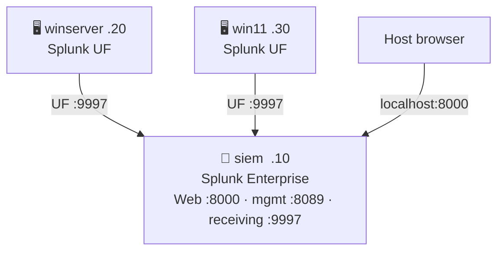

# Splunk SIEM
{: .no_toc }

Splunk Enterprise instead of ELK, on the same `siem` VM. Mutually exclusive — only one SIEM stack runs per deploy.
{: .fs-6 .fw-300 }

---

## Table of contents
{: .no_toc .text-delta }

1. TOC
{:toc}

---

## Deployment

```bash
ENABLE_SPLUNK=true vagrant up
```

`winserver`/`win11` install a Splunk Universal Forwarder instead of Elastic
Agent, forwarding to `siem:9997`.

## Network



## Credentials

Written to `logs/splunk-credentials.txt` after provisioning:

```
Splunk Web : http://localhost:8000
Username   : admin
Password   : <auto-generated>
License    : Enterprise (licensed) | Free/Trial (no valid license applied)
Receiving  : 192.168.56.10:9997
```

## License (optional)

A Splunk Enterprise license file at `splunk/Splunk.License` (gitignored,
not tracked in this repo — bring your own) is **optional**. Its
`<expiration_time>` field (Unix epoch) is checked before every deploy:

- **Present and not expired** → applied automatically, Splunk runs licensed.
- **Missing, unreadable, or expired** → provisioning continues anyway in
  **Splunk Free/Trial mode** instead of failing (single indexer, no auth
  roles, no alerting/distributed search). The active mode is always
  recorded in `logs/splunk-credentials.txt` and logged during provisioning
  — check there rather than assuming.

Get a personal developer license from [dev.splunk.com](https://dev.splunk.com/)
and place it at `splunk/Splunk.License`.

## Verify

```bash
bash tests/check-splunk.sh
```

Checks, in order:

1. Splunk Web responding
2. Wrong credentials are actually rejected (HTTP 401) — auth is enforced, not just present
3. Real login with the generated admin password
4. Active license group (Enterprise / Trial / Free) via the REST API
5. Actual events indexed from `WIN-SRV22` and `WIN11-WS01` — not just that port 9997 is open

`tests/check-lab.sh` delegates to this script automatically when
`ENABLE_SPLUNK=true` is set.

## Notes

- `scripts/splunk-provision.sh` installs Splunk Enterprise from the official
  `.deb` package (downloaded directly on the `siem` VM), not from a
  third-party apt repo.
- Splunk 10.x refuses to run as root without `--run-as-root` — this lab runs
  Splunk as root (no dedicated `splunk` service account), consistent with
  its existing minimal-hardening posture (Fleet Server also runs
  insecure-http/`0.0.0.0`, no TLS anywhere in the lab).
- Re-provisioning resets the admin password to a newly generated one each
  time, the same idempotency pattern `elk-provision.sh` uses for the
  `elastic` user.

→ [Usage](usage.html)
