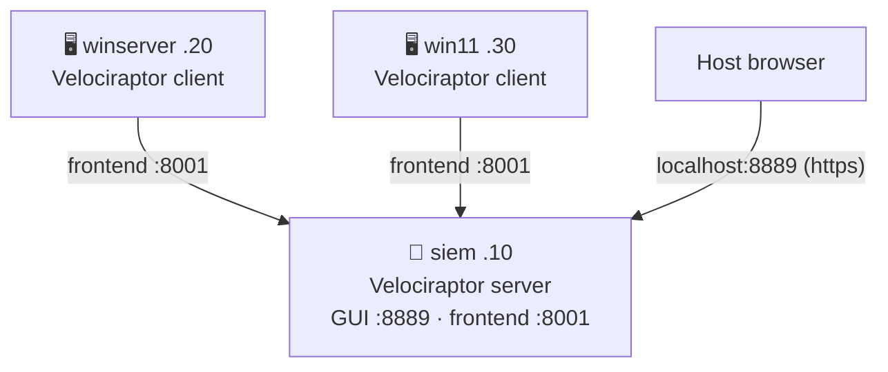

# Velociraptor
{: .no_toc }

Live triage / VQL hunting console on `siem`, alongside whichever SIEM stack is running (ELK/Splunk/Wazuh). Additive, not mutually exclusive — it's not a log-analysis SIEM.
{: .fs-6 .fw-300 }

{: .note }
Implemented but not yet validated against a full end-to-end deploy. The
server-side `.deb` packaging step and the exact systemd unit name are the
least-tested parts — check `logs/velociraptor-provision.log` if the service
doesn't come up.

---

## Table of contents
{: .no_toc .text-delta }

1. TOC
{:toc}

---

## Deployment

```bash
ENABLE_VELOCIRAPTOR=true vagrant up
```

`winserver`/`win11` install the Velociraptor client in addition to whichever
ELK/Splunk/Wazuh agent they're already running.

## Network



Frontend is `8001`, not Velociraptor's `8000` default — that port already
belongs to Splunk Web on this same VM (`ENABLE_SPLUNK=true`).

## Credentials

Written to `logs/velociraptor-credentials.txt` after provisioning:

```
GUI      : https://localhost:8889
Username : admin
Password : <auto-generated>
```

## Client install

`winserver-velociraptor-agent.ps1`/`win11-velociraptor-agent.ps1` don't
need an enrollment token: `velociraptor-provision.sh` repacks the client
config directly into the Windows MSI (`velociraptor config repack --msi`,
Velociraptor's own documented mechanism for unattended installs) and drops
it at `logs/velociraptor-client.msi`. The agent scripts just wait for that
file and run it silently — same shape as the Fleet enrollment token handoff
from `elk-provision.sh`, but the client never has to make a separate
enrollment request.

## Notes

- Server binary/version is pinned in `scripts/velociraptor-provision.sh`
  (`VELOCIRAPTOR_VER`), not resolved against GitHub's "latest" release at
  provision time — bump it there when you want a newer version.
- Not idempotent on top of an existing install: Velociraptor only stores a
  password hash, so a re-provision can't recover the original admin
  password. If the service is already running, the script skips straight
  to "already installed" rather than replaying user creation.
- No `tests/check-velociraptor.sh` yet — verify manually via the GUI
  (agents show up under **Clients** once enrolled) until one exists.
- Kali is intentionally left out — clients are Windows-only for now.

→ [Usage](usage.html)
