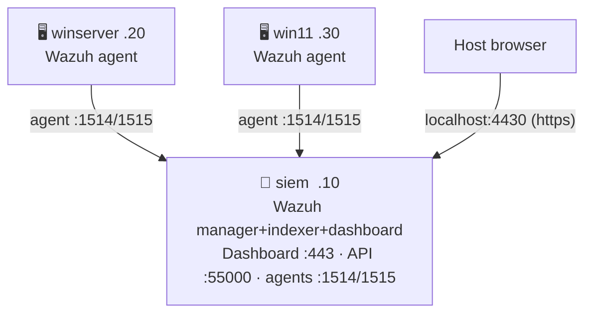

# Wazuh SIEM
{: .no_toc }

Wazuh all-in-one instead of ELK/Splunk, on the same `siem` VM. Mutually exclusive — only one SIEM stack runs per deploy.
{: .fs-6 .fw-300 }

{: .note }
Newest of the three SIEM options — implemented but not yet validated
against a full end-to-end deploy the way ELK/Splunk have been. Expect
rough edges on first real use; check `logs/wazuh-provision.log` if
something looks off.

---

## Table of contents
{: .no_toc .text-delta }

1. TOC
{:toc}

---

## Deployment

```bash
ENABLE_WAZUH=true vagrant up
```

`winserver`/`win11` install and enroll the Wazuh agent instead of Elastic
Agent or Splunk UF.

## Network



## Credentials

Written to `logs/wazuh-credentials.txt` after provisioning:

```
Dashboard   : https://localhost:4430
Username    : admin
Password    : <auto-generated>

Manager API : https://localhost:55000
API user    : wazuh
API password: <auto-generated>
```

The agent registration password (used internally by winserver/win11 to
enroll) is in `logs/wazuh-registration-password.txt`.

## Verify

```bash
bash tests/check-wazuh.sh
```

Checks, in order:

1. Dashboard responding
2. Wrong credentials are actually rejected (HTTP 401) — auth is enforced, not just present
3. Real login to the manager API with the generated `wazuh` API password
4. `WIN-SRV22` and `WIN11-WS01` show as `active` agents — not just that port 1514/1515 is open

`tests/check-lab.sh` delegates to this script automatically when
`ENABLE_WAZUH=true` is set.

## Notes

- `scripts/wazuh-provision.sh` installs the official all-in-one stack
  (manager + indexer + dashboard) via `wazuh-install.sh -a` — the same
  script/flow documented at
  [documentation.wazuh.com](https://documentation.wazuh.com/current/quickstart.html).
- The dashboard/API passwords are the ones the installer generates
  (extracted from `wazuh-install-files.tar`). The agent registration
  password is instead set deterministically by this lab's script
  (`/var/ossec/etc/authd.pass`), not read back from a random one Wazuh
  picks internally.
- Not idempotent on top of an existing install — re-provisioning skips the
  install step entirely if Wazuh is already present, unlike ELK/Splunk's
  scripts which tolerate being re-run.

→ [Usage](usage.html)
